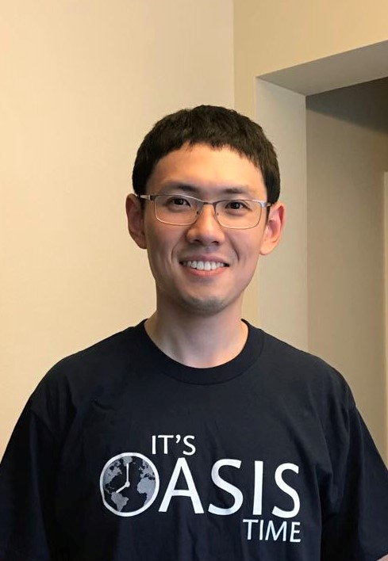

# Zheming Gao (高哲明)
  
  
  Assistant Professor  
  College of Information Science and Engineering  
  [Northeastern University](http://english.neu.edu.cn/) (Shenyang, China)

## About

Zheming Gao joined the College of Information Science and Engineering at Northeastern University (CN) in 2021. 
He currently works on

* Methodologies of machine learning 
* Optimization theories
* Numerical optimization and algorithm design
* Operations management  

with applications to financial risk forecasting, supply chain management, healthcare, and other areas of data analytics and optimization. 
His work is highly interdisciplinary. He is looking to collaborate with researchers from engineering, mathematics, computer science, and medicine.

## Education

* Ph.D., Operations Research, North Carolina State University, 2020.  
*Co-Advisors:* [Dr. Shu-Cherng Fang](https://www.ise.ncsu.edu/people/fang), [Dr. Negash G. Medhin](https://math.sciences.ncsu.edu/people/ngmedhin/).
* M.S., Operations Research, North Carolina State University, 2019.
* M.S., Mathematics, Texas A&M University, 2016.  
* B.S., Mathematics, Beihang University, 2015.

## Contact

**Email:**  gaozheming at neu dot edu dot cn

## Useful links

[Zheming Gao's Google Scholar webpage](https://scholar.google.com/citations?user=jfM50lsAAAAJ&hl=en&oi=ao)

[Fangroup](https://www.ise.ncsu.edu/fuzzy-neural/)

[Zheming's github page](https://github.com/tonygaobasketball/)
